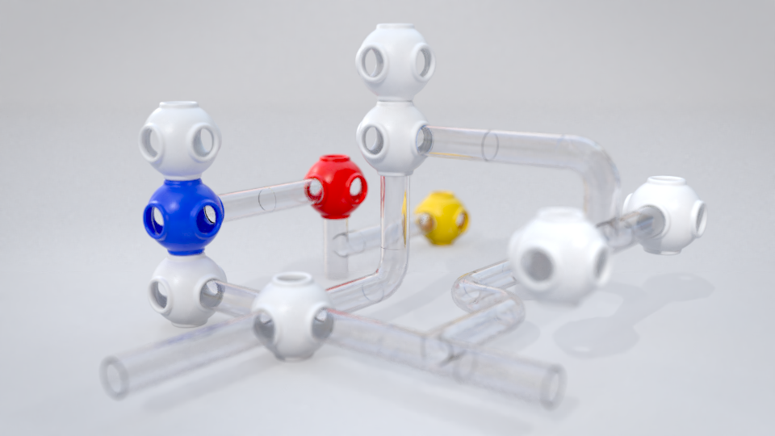

# Testudo3D 

# [VIDEO](https://www.youtube.com/watch?v=4p2CRIq-Aa0)  

If you are interested in using an extremely modular approach for a game development project or CG artwork, this is the addon for you.
  
unique features:
* Use multiple 'roots' and transform them to break repetition
* use fast mouse controls or precise keyboard controls
* grab, copy and paste regions of tiles 
* auto-generate tilesets from just a wall, floor and ceiling mesh
* Blender's layers work perfectly to manage detailed scenes
* 'make tiles real' to make unique changes to each tile to further break repetition
* implements [turtle graphics](https://en.wikipedia.org/wiki/Turtle_graphics)! (hence the name)

see the [documentation](wiki.md) for more info