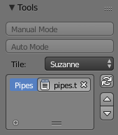
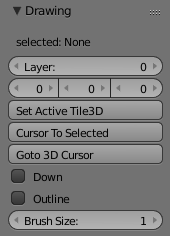
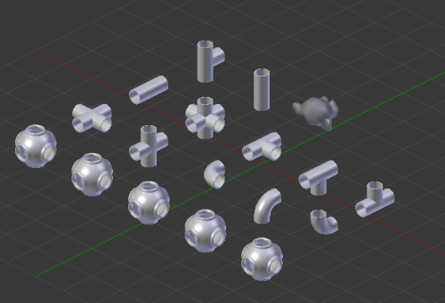
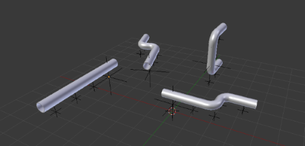
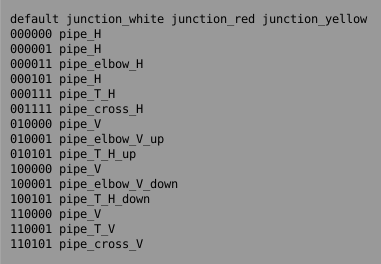
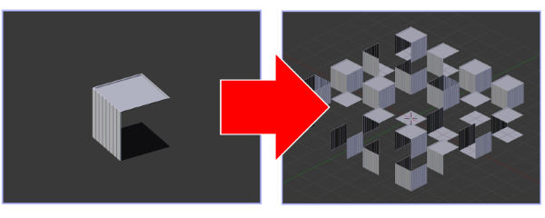

# Intro
**Testudo3D (T3D)** adds an interactive mode to help place tiling modules.  
T3D simply helps create and position 
[dupli-groups](https://docs.blender.org/manual/en/dev/editors/3dview/object/properties/duplication/dupligroup.html).  
Expert users can use **auto-tiling** to procedurally generate tilemaps.

This tool was initially designed for game developers,
but it could have some interesting uses beyond game development.  
  
Using Blender as a level editor is a radical choice, but there are compelling reasons to try it:
* do modeling and level design simultaneously
* use the program you are already comfortable with
* game engine independent (no platform lock-in!)
* blender is free and open source
* blender is easy to script and extend with addons

__Note__ if you intend to use for game development, you will have to figure out the __export__ part yourself.  
If you can't figure out how to import a scene made with blender into your game engine, 
this tool will not be much use to you as a level editor.

**Tested with 2.78 and 2.79**

__Limitations__
* Blender doesn't perform as well as you might expect with 100's of objects in the scene.
* auto-tiling doesn't do **diagonals** or **terrain**
* tiles must be 1x1x1
* can only undo once exit modal operator (but it does work)
* controls not configurable (todo)

# Contact
If you find a bug or something to be improved, please contact __alcornwill@gmail.com__

# Turtle Graphics?
[wikipedia](https://en.wikipedia.org/wiki/Turtle_graphics)  
(This is where the name comes from, Testudo = Tortoise in latin)  
to see an example of turtle graphics, run the unit tests in 'test/run_tests.py'  
**NOTE** you must have **blender in your environment variables** to run the tests  
Python also has some turtle graphics samples you can run  **(Python36\Lib\turtledemo)**

# Install
The folder you need to install is __testudo3d/testudo3d/__  
i.e.
 * __unzip__ testudo3d.zip
 * find testudo3d/testudo3d/
 * __zip it__
 * in Blender, install __testudo3d.zip__ (User Prefs > Addons > Install From File)

You will find all the tool's operators in the __T3D tab__. (3DView > T3D)
  
# T3D Tab
  
  
*tools panel*
  
__Tools Panel__

* __Manual Mode__ position tiles by hand, choose specific tile to paint with
* __Auto Mode__ automatically choose tile and rotation from __rules__ (aka **auto-tiling**)
* __Active Tile__ the active tile used in __Manual Mode__
* __Tileset List__ the list of tilesets in the blend. A Tileset can have __rules__.
* __Refresh Tilesets__ refresh the tileset list

  
*drawing panel*

**Drawing Panel**
* **Active Layer** tiles will be created/deleted in the active layer
* **Cursor Pos** cursor position
* **Set Active Tile3D** set the selected __tile__ as the active tile
* **Cursor To Selected** move the cursor to the selected tile
* **Goto 3D Cursor** move the cursor to the 3D cursor (draws a line if 'down')
* **Down** is the 'paintbrush' down 
* **Outline** draw an outline instead of a filled circle
* **Brush Size** the size of the circle

  
*utils panel*

**Utils Panel**
* **Link Tile Library** convenience tool to link a tile library
* **Set/Clear Tileset** set/clear the tileset that selected tiles belong to
* **Setup 3D Tiles** essential utility for creating tiles
* **Room Gen** powerful tool for automatically generating a tileset + rules
* **Make Tiles Real** like 'Make Duplicates Real' but only top-level
* **Align Tiles** align objects to the grid (if you have been moving by hand)

  
*object properties panel*

**Object Properties Panel**
* **Tileset** The name of the tileset this object belongs to (greyed out if not pressed **Setup 3D Tiles**)

# Workflow
overview
* Create a set of tiles
* use **Setup 3D Tiles** to automatically create groups for every object in the scene and arrange them nicely
* add the tiles to a **Tileset** (select object, Properties > Object > T3D > Tileset)
* refresh the tileset list

additionally, if using auto-tiling
* Create the rules
* link the rules to the tileset

Once setup, you can hit **Manual Mode** or **Auto Mode** to start painting.  
The __testudo3d/samples/__ folder contains lots of blends with tiles and rules already setup,
if you just want to get started.  

# Tiles
a **Tile** is just a [group instance](http://blender-manual-i18n.readthedocs.io/ja/latest/modeling/groups.html).  
You should not create groups yourself as **Setup 3D Tiles** will do this automatically.  

To create a tile:
* Create a top-level object in the scene. The object can have any number of children.  
The __object origin__ should be at the bottom of the tile (see sample blends for examples)
* press **Setup 3D Tiles**.  
This will add the tile and it's children to a **group** of the same name, so it can be [duplicated](https://docs.blender.org/manual/en/dev/editors/3dview/object/properties/duplication/dupligroup.html).  
It will also layout your tiles nicely
* set the **Tileset** (select object, Properties > Object > T3D > Tileset)  
A tile must belong to a Tileset.  
To add multiple tiles to a tileset at once, use **Copy To Selected**
  
Tiles can be any size, though they must be **1x1x1** to tile.  
(actually, there is a hack for changing tile z. on a root empty, change the custom property 't3d_tile_size_z')  
Since they're just objects, you can add, delete, move them around and rotate them by hand if you want  

__Tip__: **Setup 3D Tiles** will not operate on hidden objects, if you want to exclude certain objects  
__Tip__: use __Align Tiles__ to align objects to grid. (3DView > T3D > Utils > Align Tiles)  
__Note__: some object types cannot be duplicated with dupli-groups

  
*Tiles (samples/pipes.blend)*

# Tilesets
A **Tileset** is just a collection of tiles.  
Once you have created some tiles and set the tileset name, press **Refresh** next to the **tileset list** to auto-detect tilesets in the scene.  
You can have tiles from multiple scenes in the same tileset; as long as the tileset name is the same, they are considered to be in the same tileset.  
If you are using **auto-tiling**, you can set the rules in the tileset list

# Roots
When you run Manual/Auto Mode, an empty called 'Root' will pop up in your scene  
Using multiple roots can help organize your scene.  
Roots can have any transformation, they do not have to stay at 0,0,0  
This helps you create levels that feel more organic, as you can break right-angles by rotating the root  

Any object under a root will be treated as a tile, 
however if the object is not an actual tile you will not be able to duplicate it.
Hence, you can actually have nested roots (a root treated as a tile).  
Though, perhaps a better way to make a tree of roots is to use a ChildOf constraint.

**NOTE** when you enter manual/auto mode, the currently selected object will be used as the root  
be careful to always select the root, or you may accidently create a nested root.  
In fact the root object can be anything. It doesn't have to be an Empty.  
If no object is selected, a new 'Root' will be created    

  
*multiple roots*

# Layers
Notice the __Layer__ number in the T3D Drawing panel  
Tiles will be created/deleted in the active layer  
Since a cell can only be occupied by one tile at a time, layers are needed to build up complex scenes  
__e.g.__ create a road on layer 0, houses on layer 1, street lamps on layer 2, ...

# Rules
Auto-tiling rules are contained in a rules file (a text data-block)  
Writing a rules file by hand is tedious, but it's simple once you understand it.  
Sometimes a rules file can be auto-generated (see RoomGen operator)  
There are plenty of examples of rules files in the **testudo3d/samples/** folder  
The template rules file __testudo3d/samples/rules.txt__
contains all possible bitmask permutations (64) should you ever want to define them all

Format:  
```
[bitmask] [tile]  
```
e.g.  
```
001001 TileA  
001010 TileB  
110001 TileC
```  
each bit of the bitmask corresponds to a direction:  
```
DUWSEN
Down Up West South East North  
(North is +y and East is +x)
```  
```
0 = unoccipied  
1 = occupied  
```
e.g. in the bitmask '000001' only North is occupied  
__NOTE__:  tiles will be rotated in Z if applicable

**Limitations**: note that the bitmask doesn't contain information for **diagonals** or **terrain**  
The 6-bit design was chosen in favor of simplicity, but it could be extended  

  
*rules (samples/pipes.blend)*  

If there are multiple tiles per bitmask, a __random__ tile will be chosen.  
This also supports wildcards (e.g. wall_* will be expanded to wall_a, wall_b, wall_c, ...)  
The __default__ tile will be used when no rule is defined for a specific bitmask


# Link
_(3DView > T3D > Utils > Link)_  
Blender's linking system is very useful for keeping your work organized.  
You may want to save each tileset in separate .blend files and link them into another .blend where you create your scene.  
The __Link__ utility will help you do this by quickly linking just the groups and text blocks from any .blend file.  

# Room Gen 
_(3DView > T3D > Utils > Room Gen)_  
If you want to create a building with **Walls**, **Floors** and **Ceilings**,
you may be able to use **Room Gen** to generate your **tiles** and **rules**  
* create 3 groups __Wall__, __Floor__ and __Ceiling__
* choose the new tileset name
* press **Room Gen** 

This will generate your tiles and rules. __Setup 3D Tiles__ is automatically called.  
The Wall should be facing north
(for an example see __testudo3d/samples/house.blend__)

  
*room gen*

# Make Tiles Real
(3DView > T3D > Utils > Make Tiles Real)  
Since tiles are just groups, it is easy to change the tile by hand. (Properties > Object > Duplication > Group)  
If your tile is itself composed of objects or groups,
you may want to change it without changing all the other tiles of the same type  
Blender does have the __Make Duplicates Real__  operator, but unfortunately it only works recursively  
__Make Tiles Real__ will only make the first level of group instances real

# Controls
Key | Action
----|----
__TAB__ | toggle mouse paint
__CURSOR KEYS__ | move
__CTRL UP/DOWN__ | move up and down
__CTRL LEFT/RIGHT__ | strafe left/right
__SHIFT CURSOR KEYS__ | move faster
__ENTER__ | paint
__X__ | delete
__CTRL C/V__ | copy/paste
__G__ | grab
__B__ | select region
__S__ | sample
__[__ | increment brush size
__]__ | decrement brush size
__SHIFT [__ | increment layer
__SHIFT ]__ | decrement layer
__ESCAPE__ | escape/cancel

**NOTE:** controls are not configurable yet (sorry)